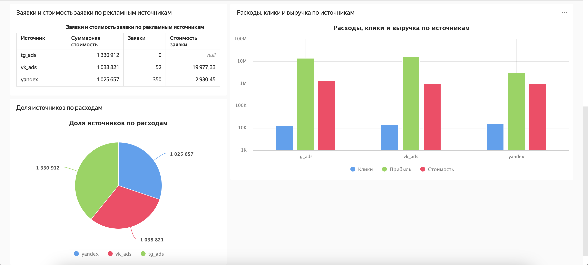

# Дашборды на Yandex DataLens

Этот репозиторий содержит набор интерактивных дашбордов, созданных в сервисе [Yandex DataLens](https://cloud.yandex.ru/services/datalens) для визуализации и анализа данных.

Здесь я практикуюсь в преобразовании сырых данных в понятные и информативные инсайты.

## Список дашбордов

### [ROMI center demo dashboard](https://datalens.yandex/uts8y1a4txcmf)
**Описание:** Визуализация результатов маркетинговой кампании. Данные тренировочные.
*   **Ключевые метрики:** расходы, клики, заявки, вырчука.
*   **Основные выводы:** Дашборд показал высокую эффективность (средний ROAS 968%) рекламных кампаний. Наибольшую эффективность показала реклама Вконтакте (ROAS 1509%).
*   **Скриншоты:**
    

      
        
    

* [Репозиторий](https://github.com/Gopstol/Dashboards/blob/main/ROMI-center-demo-dashboard/README.md)

---

## Контакты

Если у вас есть вопросы или предложения:

*   **Email:** tsarkov.d.s@gmail.com
*   **Telegram:** [@gopchansky](https://t.me/gopchansky)
