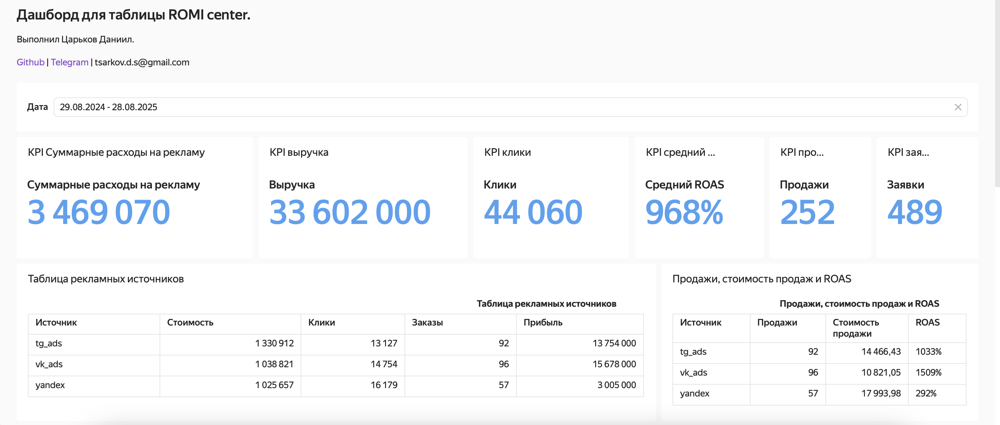
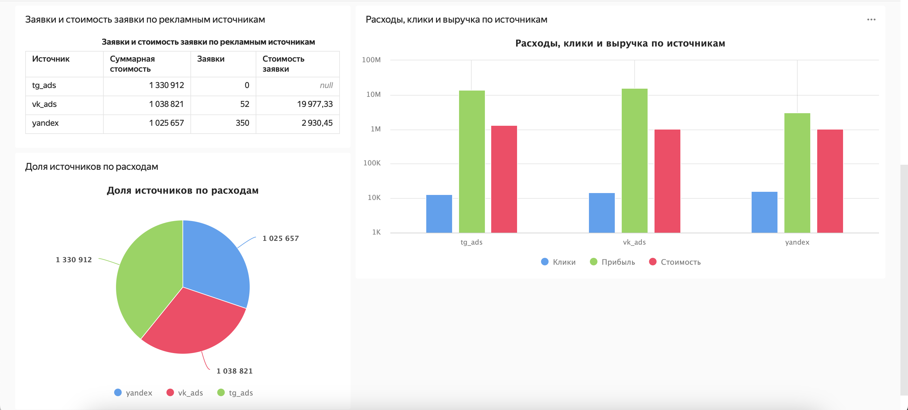

# ROMI Center: Demo Dashboard

 

Интерактивный дашборд для анализа эффективности рекламных кампаний из различных источников. Сделано в качестве тестового задания для ROMI center.

---

## О дашборде

Этот дашборд был создан на основе демонстрационных данных рекламного кабинета. Его цель — наглядно показать ключевые метрики производительности кампаний и помочь определить наиболее эффективные каналы для оптимизации рекламного бюджета.

**Публичная ссылка на дашборд:** [Открыть в Yandex DataLens](https://datalens.yandex/uts8y1a4txcmf)

## Ключевые метрики

Дашборд позволяет отслеживать и анализировать следующие показатели:
*   **Расходы (costs):** Общий бюджет, потраченный на рекламные кампании.
*   **Клики (clicks):** Количество переходов по рекламным объявлениям.
*   **Заявки (leads):** Количество целевых действий (конверсий).
*   **Выручка (revenue):** Общий доход, полученный от рекламных кампаний.
*   **ROAS (Return On Ad Spend):** Рентабельность. Рассчитывается как `(Выручка / Расходы) * 100%`.

## Основные выводы

Анализ данных, проведенный с помощью дашборда, выявил следующие закономерности:

> **Высокая общая эффективность:** Средний показатель **ROAS по всем кампаниям составил 968%**, что свидетельствует о чрезвычайно высокой отдаче от вложенных рекламных средств.

> **Лидер по эффективности:** Наибольшую результативность продемонстрировала реклама **во Вконтакте (ROAS 1509%)**, что делает этот канал наиболее приоритетным для дальнейшего инвестирования.

## Скриншоты дашборда

  
  

## Технологии

*   **Платформа:** Yandex DataLens
*   **Визуализация:** Интерактивные чарты, сводные таблицы, показатели
*   **Data Connection:** Google Sheets

## Контакты

Если у вас есть вопросы или предложения по сотрудничеству, буду рад общению!

**Telegram:** [@gopchansky](https://t.me/gopchansky)

**Почта:** tsarkov.d.s@gmail.com
